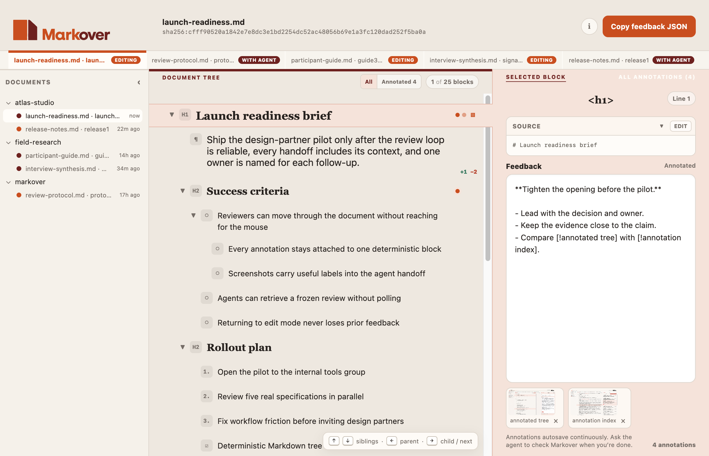
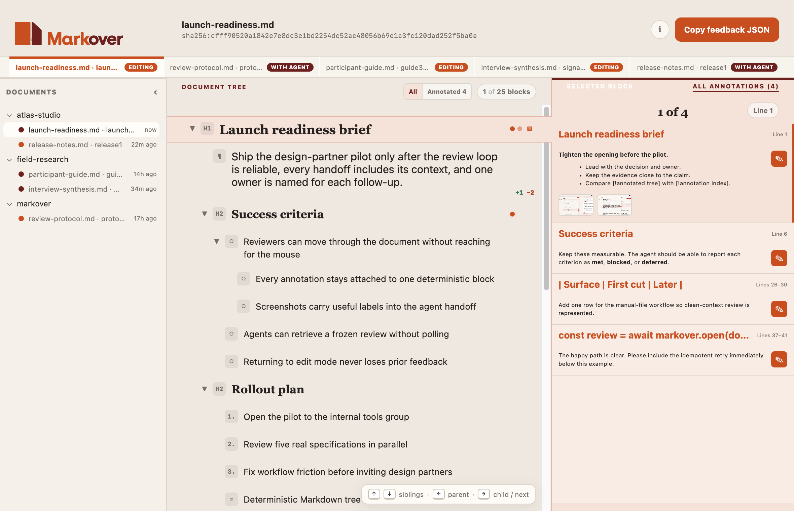

<p align="center">
  
</p>

<p align="center">
  <a href="https://lastobelus.github.io/markover/">Website</a>
  ·
  <a href="https://lastobelus.github.io/markover/guide/">User guide</a>
  ·
  <a href="https://lastobelus.github.io/markover/privacy/">Privacy and local data</a>
  ·
  <a href="./docs/development.md">Development</a>
</p>

Markover is a macOS app for reviewing Markdown as a document tree and returning
block-level feedback to an agent.

<p align="center">
  
</p>

<p align="center">
  
</p>

## Features

- Navigable, collapsible blocks for YAML frontmatter, headings, paragraphs,
  lists, tasks, code, tables, block quotes, and thematic breaks.
- Markdown feedback and labeled screenshot attachments on individual blocks.
- A durable multi-document inbox grouped by project, with an all-annotations
  browser.
- A documented two-second default process-crash autosave window with automatic
  restart recovery; see [Durability and recovery](https://lastobelus.github.io/markover/guide/#durability)
  for the guarantee and its limits.
- Exact source-edit proposals shown as word-level diffs without changing the
  original review target.
- One-shot agent handoff containing the exact source, checksum, document tree,
  annotations, attachments, and review context.

## Try without installing

Markover supports macOS 14 Sonoma or newer on Apple Silicon Macs and
requires Node.js 22.13.0 or newer for the launcher. Open a document with:

```sh
npx --yes \
  --package=https://github.com/lastobelus/markover/releases/latest/download/markover-cli.tgz \
  markover open ./DOCUMENT.md \
  --summary "Explain why this document exists and what feedback would help."
```

The command downloads the Apple Silicon app on first use. Native Intel releases
are deferred to the Broad announcement roadmap in
[issue #80](https://github.com/lastobelus/markover/issues/80).
Release launchers produced from the hardened preflight verify its checksum,
bundle identity, version, architecture, Sonoma floor, ad-hoc signature, and
code seal before moving it into the cache. Later commands reuse that validated
version. The launcher returns a review ID and exits without waiting for the
review:

```json
{"reviewId":"mko_8f3a2c","status":"editing"}
```

If you are an agent, retain the returned `reviewId` and stop. When the user says “Check
Markover,” run the same launcher with `get <reviewId>`:

```sh
npx --yes \
  --package=https://github.com/lastobelus/markover/releases/latest/download/markover-cli.tgz \
  markover get mko_8f3a2c
```

The returned JSON includes a fixed interpretation contract and the review's
snapshotted interpretation policy under `review.agentGuidance`. Together they
tell the agent to distinguish revision requests, questions, discussion,
context, and source-edit proposals instead of treating every annotation as an
edit request. Markover carries this guidance; it does not classify annotations
or apply changes itself.

If the reviewer needs to change their feedback after handoff, use `edit` with
the same review ID.

## Opening Markover on macOS

Markover downloads are **not Apple-verified**. They use hardened ad-hoc signing
to make code changes detectable, but they do not have an authenticated
Developer ID publisher and are not notarized. Gatekeeper is therefore expected
to block the first launch.

After a blocked launch, open **System Settings → Privacy & Security**, find the
message about Markover under **Security**, choose **Open Anyway**, and confirm
**Open**. If you downloaded the app manually, you can instead Control-click
`Markover.app` in Finder and choose **Open**, then **Open** again. Apply an
override only to a Markover archive whose SHA-256 checksum you obtained from
the same GitHub Release. Do not recursively remove quarantine attributes.

Published `v0.1.1` predates the hardened preflight and remains an untouched
historical release. Consult each release's notes for its exact trust status.
Apple verification remains gated on Apple Developer Program access.

Post-policy releases publish SHA-256 sidecars, GitHub build-provenance
attestations, the exact source and workflow, resolved build context, and a
version-pinned known-good rollback command. Published bytes are never replaced
under an existing tag. See the [release and rollback runbook](./docs/releasing.md)
for verification, backup, withdrawal, and future Developer ID activation.

See the [user guide](https://lastobelus.github.io/markover/guide/)
for the complete review workflow and keyboard controls, read
[Privacy and local data](https://lastobelus.github.io/markover/privacy/)
for Markover's storage, network, and macOS-account boundary, or see
[development.md](./docs/development.md) for checkout, testing, packaging, and
release notes.

## Community

- [Contributing](./CONTRIBUTING.md)
- [Roadmap](./ROADMAP.md)
- [Security policy](./SECURITY.md)
- [Code of conduct](./CODE_OF_CONDUCT.md)
- [Discussions](https://github.com/lastobelus/markover/discussions) for early
  ideas and questions
