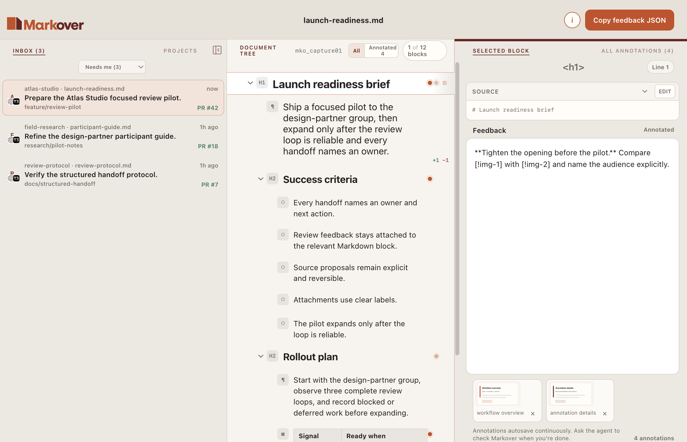
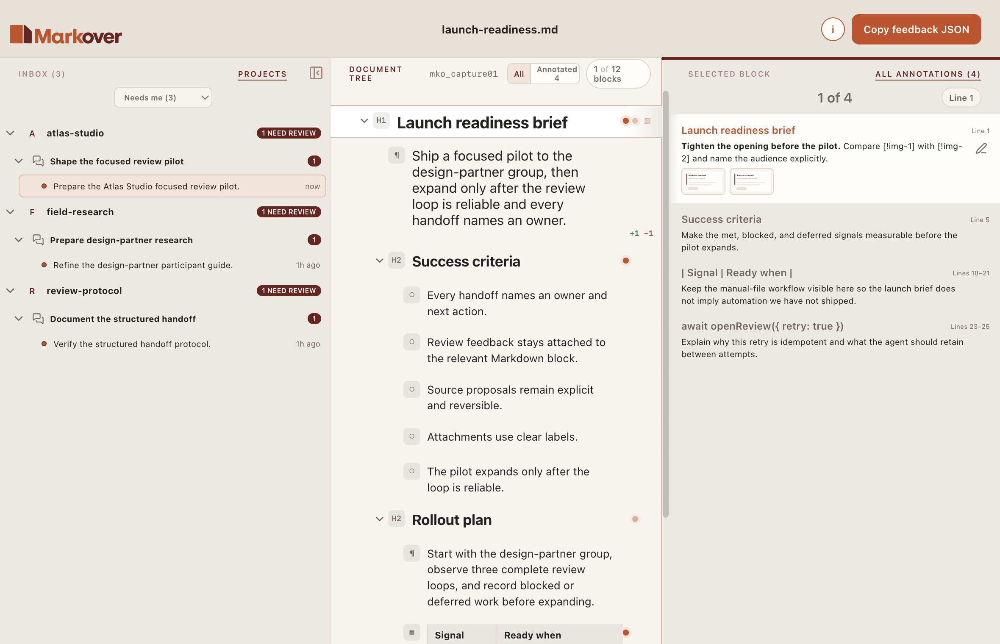

<p align="center">
  
</p>

<p align="center">
  <a href="https://lastobelus.github.io/markover/">Website</a>
  ·
  <a href="https://lastobelus.github.io/markover/guide/">User guide</a>
  ·
  <a href="https://lastobelus.github.io/markover/privacy/">Privacy and local data</a>
  ·
  <a href="https://lastobelus.github.io/markover/limitations/">Limitations</a>
  ·
  <a href="https://lastobelus.github.io/markover/agents/">For agents</a>
</p>

Markover is an **Early macOS preview** for reviewing Markdown as a document
tree and returning block-level feedback to an agent.

<p align="center">
  
</p>

<p align="center">
  
</p>

## Features

- Navigable, collapsible blocks for YAML frontmatter, headings, paragraphs,
  lists, tasks, code, tables, block quotes, and thematic breaks.
- Markdown feedback and labeled screenshot attachments on individual blocks.
- A document browser with inbox and project views.
- Autosave and automatic restart recovery.
- Exact source-edit proposals shown as word-level diffs without changing the
  original review target.
- One-shot agent handoff containing the exact source, checksum, document tree,
  annotations, attachments, and review context.

## Before you try the early preview

- Markover supports macOS 14 Sonoma or newer on Apple Silicon Macs. Native
  Intel releases are deferred to [issue #80](https://github.com/lastobelus/markover/issues/80).
- The launcher requires Node.js 22.13.0 or newer.
- Downloads are hardened and ad-hoc signed, but **not Apple-verified** or
  notarized. macOS is expected to block the first launch.
- Ordinary review work stays in your macOS account. Markover has no telemetry,
  analytics, cloud sync, or automatic review upload.
- Early-preview review formats may change without migration guarantees.
  Historical review JSON and attachments are preserved, but a newer Markover
  version may not open every older review. Back up important review data before
  changing versions.

Read [Privacy, storage, and recovery](https://lastobelus.github.io/markover/privacy/)
for local-data and cleanup consequences, and [Markdown support and preview
limitations](https://lastobelus.github.io/markover/limitations/) before relying
on extension-specific rendering. Ask usage questions in [GitHub
Discussions](https://github.com/lastobelus/markover/discussions).

## For agents: open a review without installing

Open a document with:

```sh
npx --yes \
  --package=https://github.com/lastobelus/markover/releases/latest/download/markover-cli.tgz \
  markover open ./DOCUMENT.md \
  --summary "Explain why this document exists and what feedback would help."
```

The command downloads the Apple Silicon app on first use. Native Intel releases
are deferred to the Broad announcement roadmap in
[issue #80](https://github.com/lastobelus/markover/issues/80).
Release launchers produced from the hardened preflight verify its checksum,
bundle identity, version, architecture, Sonoma floor, ad-hoc signature, and
code seal before moving it into the cache. Later commands reuse that validated
version. The launcher returns a review ID, status, and OS-openable custom URL,
then exits without waiting for the review:

```json
{"reviewId":"mko_8f3a2c","status":"editing","reviewUrl":"markover://review/mko_8f3a2c"}
```

If you are an agent, retain the returned `reviewId`, present a best-effort
`[Open in Markover](markover://review/mko_8f3a2c) (mko_8f3a2c)` link, and also
put the reliable Terminal fallback on its own line:

`open 'markover://review/mko_8f3a2c'`

Custom-scheme Markdown links depend on the thread-host; T3 Code and the Codex app do not
currently dispatch them. Then stop. See the dedicated [agent
workflow](https://lastobelus.github.io/markover/agents/) for retrieval,
reopening, and interpretation guidance.

## Opening Markover on macOS

Markover downloads are **not Apple-verified**. They use hardened ad-hoc signing
to make code changes detectable, but they do not have an authenticated
Developer ID publisher and are not notarized. Gatekeeper is therefore expected
to block the first launch.

After a blocked launch, open **System Settings → Privacy & Security**, find the
message about Markover under **Security**, choose **Open Anyway**, and confirm
**Open**. If you downloaded the app manually, you can instead Control-click
`Markover.app` in Finder and choose **Open**, then **Open** again. Apply an
override only to a Markover archive whose SHA-256 checksum you obtained from
the same GitHub Release. Do not recursively remove quarantine attributes.

See [GitHub Releases](https://github.com/lastobelus/markover/releases) for each
release's checksums, provenance, trust status, and rollback information.

See the [user guide](https://lastobelus.github.io/markover/guide/)
for the complete review workflow and keyboard controls, read
[Privacy, storage, and recovery](https://lastobelus.github.io/markover/privacy/)
for Markover's storage, network, and macOS-account boundary.

## Contributing

Contributor and implementation documentation is kept separately from the user
guide. Start with the [developer documentation](./docs/developer/README.md) for
checkout setup, architecture, security mechanics, tests, packaging, and release
operations.

## Community

- [Contributing](./CONTRIBUTING.md)
- [Roadmap](./ROADMAP.md)
- [Security policy](./SECURITY.md)
- [Code of conduct](./CODE_OF_CONDUCT.md)
- [Discussions](https://github.com/lastobelus/markover/discussions) for early
  ideas, usage questions, and general support
- [Report a problem](https://github.com/lastobelus/markover/issues/new?template=bug.yml)
  with the smallest sanitized reproduction of a defect
