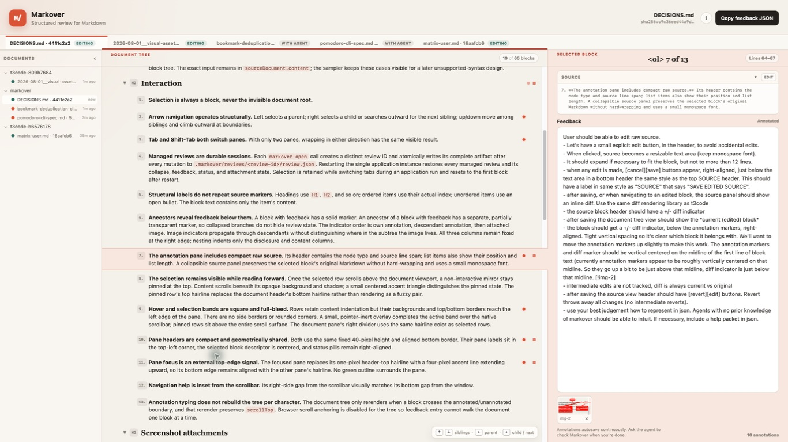
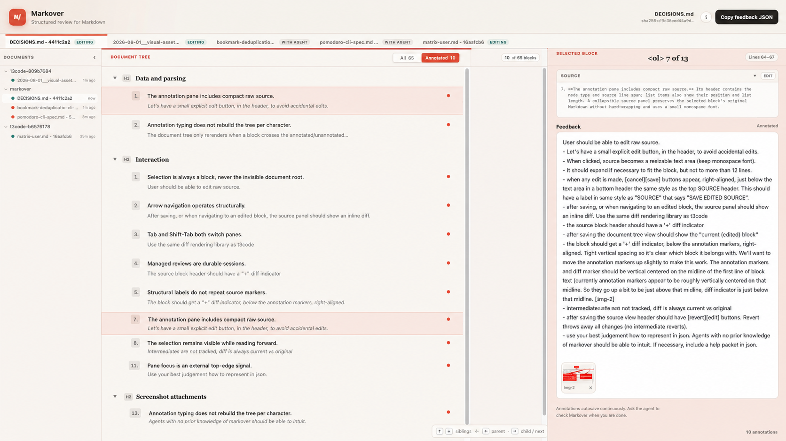
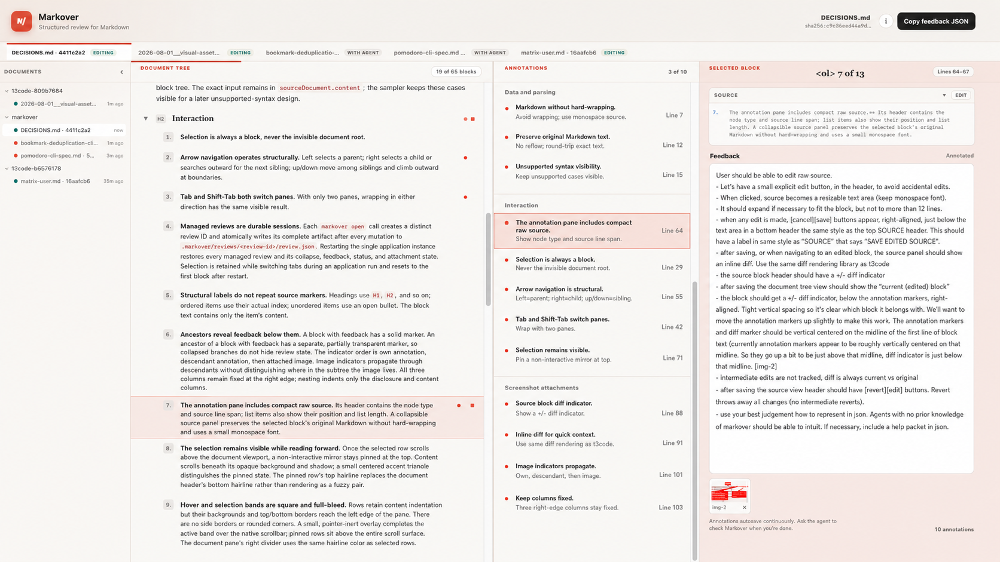
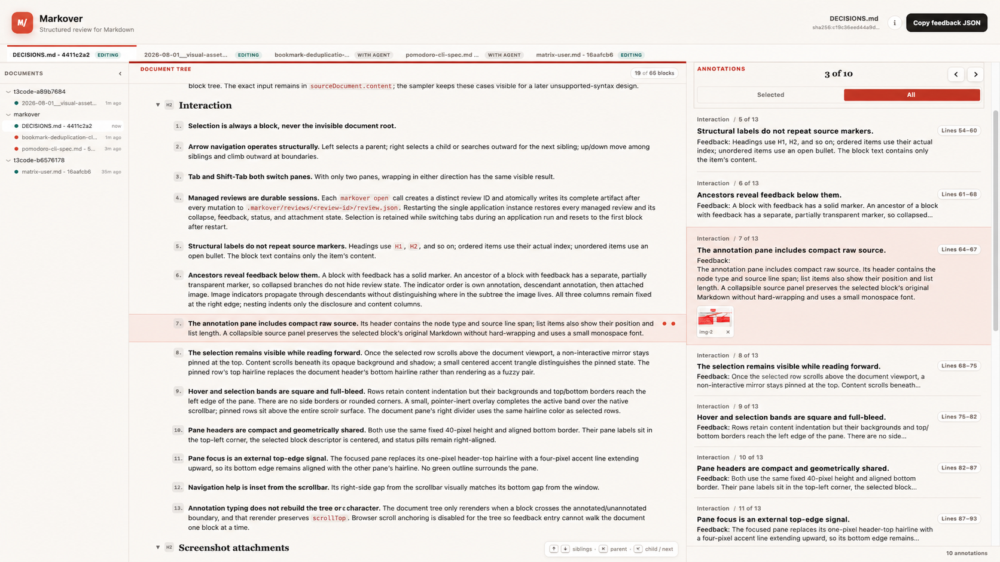
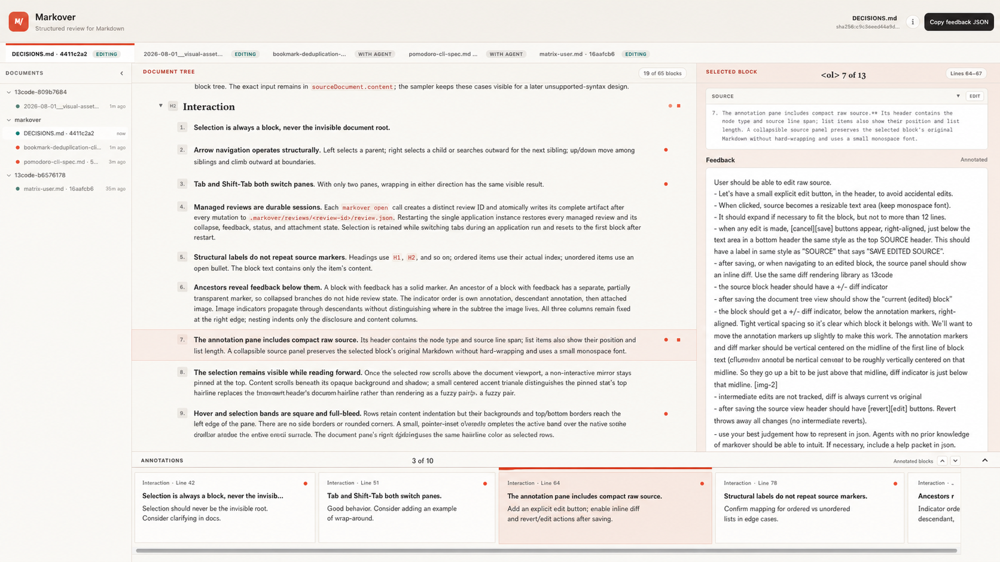
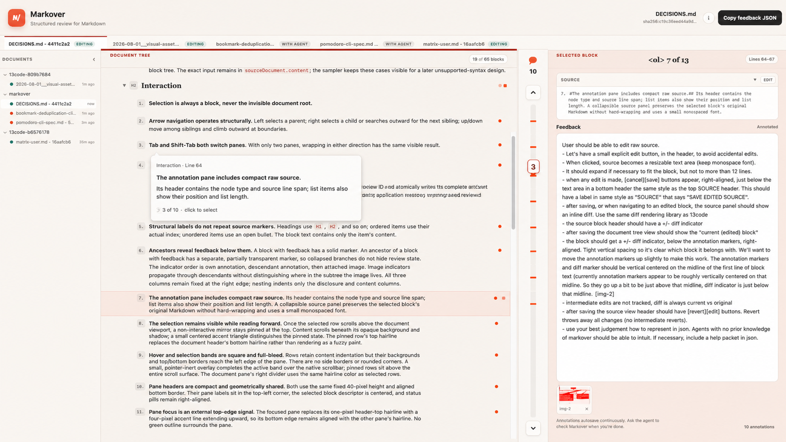

# Annotation browser concepts

These five concepts start from the current `DECISIONS.md` review with ten real
annotations. They explore different navigation models rather than cosmetic
variants.

## Baseline

The current interface exposes annotation markers in the document tree and the
selected block's feedback on the right. It does not provide a direct way to
scan every annotation.

## 1. Annotated-only tree filter

Add an `All 65 / Annotated 10` view switch to the document-tree header. The
filtered view retains the minimum ancestor headings needed for orientation and
adds a one-line feedback excerpt below each annotated source block.

This is the recommended first cut. It reuses the existing selection, tree,
keyboard navigation, annotation pane, and responsive layout. The main design
question is whether feedback excerpts should always appear in filtered mode or
only for the selected and hovered rows.

## 2. Dedicated annotation index

Insert a narrow annotation index between the document tree and selected-block
pane. Entries are grouped by document heading and show source title, feedback
excerpt, and line number.

This is the clearest power-user model if reviews routinely contain dozens of
annotations, but it is expensive in horizontal space and introduces a fourth
focus destination when the documents list is open.

## 3. Right-pane annotation stack

Give the right pane `Selected / All` modes. `All` renders annotations as a
scrollable stack; selecting an entry synchronizes the document tree. The active
annotation can remain expanded while neighbors show compact previews.

This provides the best uninterrupted reading flow and costs no new pane. Its
tradeoff is that browsing temporarily replaces the focused annotation editor,
so mode and keyboard behavior need to be unmistakable.

## 4. Bottom annotation drawer

Add a collapsible drawer spanning the two review panes. A horizontal strip of
annotation previews leaves both the document and selected annotation visible.

This supports occasional overview without changing the established panes, but
it reduces document height and turns a naturally vertical review sequence into
horizontal scrolling.

## 5. Annotation minimap rail

Add a narrow rail showing every annotation at its proportional document
position. Hovering a tick previews its source and feedback; clicking selects
and scrolls to it. Previous and next controls support linear traversal.

This is the smallest permanent footprint and communicates annotation density
well. It is a useful later complement, but previews make it weaker than the
other concepts for actually reading all annotations.

## Recommendation

Prototype the annotated-only tree filter first. It proves whether reviewers
want to scan annotations alongside their source context without committing to
another pane or navigation model. Keep the implementation deliberately narrow:

- One `All / Annotated` switch in the document-tree header.
- Annotated nodes plus their ancestor headings in document order.
- One-line feedback excerpts in the filtered view.
- Existing selection and right-pane editing behavior.
- Preserve the selection when it remains visible; otherwise select the nearest
  annotated block in document order.
- Existing arrow-key semantics applied to the filtered visible tree.

If dogfooding shows that reviewers spend long sessions reading annotations in
sequence, the right-pane stack is the strongest second experiment. The
dedicated index becomes worthwhile only when annotation counts and window
widths make its persistent extra pane feel justified.
